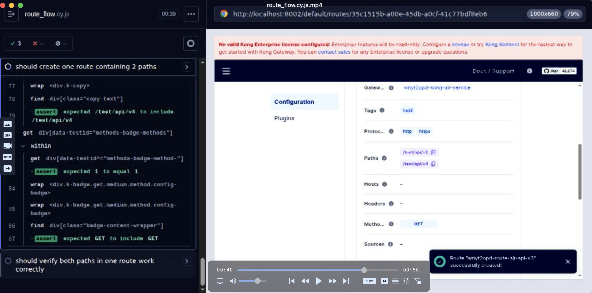

# Issue: Route Path Verification Test Fails in CI (Ubuntu) but Passes on macOS

## Summary

The Cypress test `should verify both paths in one route work correctly` in `cypress/e2e/route/route_flow.cy.js` fails consistently in GitHub Actions CI environment (Ubuntu) but passes successfully in local macOS development environment.

## Test Details

**Test File:** `cypress/e2e/route/route_flow.cy.js`  
**Test Name:** `should verify both paths in one route work correctly`  
**Test Line:** 182-195

## Current Behavior

### macOS (Local Development) ✅
- Test passes successfully
- Both paths (`/test/api/v3` and `/test/api/v4`) are verified correctly
- Route is created with both paths configured correctly
- REST API calls to both paths return expected 200 status

### GitHub Actions CI (Ubuntu) ❌
- Test is currently **skipped** in CI (configured to skip when `Cypress.env('CI')` is true)
- When not skipped, the test fails during verification
- Route creation succeeds (verified via screenshots and videos from CI)
- Route configuration shows both paths correctly configured in Kong Gateway UI
- First path (`/test/api/v3`) verification may pass
- Second path (`/test/api/v4`) verification fails - REST API call does not return expected response

## Test Flow

1. **Route Creation** (Line 161-180)
   - Creates a route with name `route-air-api-v3`
   - Configures route with **two paths**: `/test/api/v3` and `/test/api/v4`
   - Method: `GET`
   - Strip Path: `false`
   - Route is successfully created and stored

2. **Path Verification** (Line 182-195)
   - Verifies first path: `/test/api/v3` via REST API call
   - Verifies second path: `/test/api/v4` via REST API call
   - Uses `verifyRoute` helper function with retry logic
   - Expected: Both paths should return HTTP 200 status

## Evidence

### Screenshot from GitHub Actions CI
The screenshot from the CI pipeline shows:
- Route was created successfully
- Route configuration displays correctly:
  - **Paths:** `/test/api/v3` and `/test/api/v4` ✅
  - **Methods:** `GET` ✅
  - **Protocols:** `http`, `https` ✅
- Kong Gateway UI shows the route configuration is correct

### Test Configuration
- **Route Data:** `cypress/fixtures/route.json` (route index 2)
- **Service:** Bound to `kong-air-service`
- **Paths:** `["/test/api/v3","/test/api/v4"]`
- **Verification Method:** REST API calls via `verifyRoute` helper function

## Root Cause Analysis

### Possible Causes

1. **Environment Differences**
   - **OS:** Ubuntu (CI) vs macOS (local)
   - **Docker/Network:** Different Docker networking behavior between Ubuntu and macOS
   - **Timing:** Race conditions or timing issues in CI environment

2. **Network/Proxy Issues**
   - Kong Gateway proxy may not be fully ready for the second path
   - Port forwarding or networking differences between Ubuntu and macOS Docker
   - DNS resolution differences

3. **Kong Gateway Configuration**
   - Route propagation delay in Kong Gateway
   - Database sync issues between control plane and data plane
   - Cache invalidation timing

4. **Test Timing**
   - Insufficient wait time between path verifications
   - Kong Gateway needs more time to propagate route changes in CI
   - Retry logic timeout may be too short for CI environment

5. **Docker Compose Environment**
   - Different Docker networking modes between Ubuntu and macOS
   - Container startup timing differences
   - Port binding or forwarding differences

## Current Workaround

The test is configured to skip automatically in CI environments:

```javascript
it('should verify both paths in one route work correctly', function() {
    // Skip this test when running in CI
    if (Cypress.env('CI')) {
        cy.log('Skipping test in CI environment')
        this.skip()
        return
    }
    // ... test code
})
```

This allows:
- ✅ Tests to run successfully in CI without blocking the pipeline
- ✅ Tests to continue running locally for development validation
- ⚠️ Reduced test coverage in CI environment

## Investigation Steps

### 1. Review CI Logs and Artifacts
- [ ] Check Cypress test logs for detailed error messages
- [ ] Review Kong Gateway logs from Docker containers
- [ ] Analyze network requests in CI environment
- [ ] Compare timing between macOS and Ubuntu

### 2. Network Debugging
- [ ] Verify Kong Gateway proxy is accessible in CI
- [ ] Test direct REST API calls to both paths manually
- [ ] Check port forwarding and networking configuration
- [ ] Compare Docker network setup between environments

### 3. Kong Gateway Investigation
- [ ] Check Kong Gateway Admin API for route status
- [ ] Verify route propagation timing
- [ ] Check database sync status
- [ ] Review Kong Gateway configuration differences

### 4. Test Enhancement
- [ ] Increase retry timeout for CI environment
- [ ] Add explicit wait between path verifications
- [ ] Add more detailed logging for debugging
- [ ] Verify Kong Gateway readiness before path verification

### 5. Environment Comparison
- [ ] Compare Docker Compose versions
- [ ] Compare Kong Gateway versions
- [ ] Compare network configurations
- [ ] Compare system resources (CPU, memory)

## Proposed Solutions

### Option 1: Increase Wait Times
Add explicit waits and increase timeouts for CI environment:

```javascript
// Add wait between path verifications
cy.wait(2000) // Wait 2 seconds between verifications
this.verifyRoute(route.routes[2], route.routes[2].path[0], 2, server)
cy.wait(2000)
this.verifyRoute(route.routes[2], route.routes[2].path[1], 2, server)
```

### Option 2: Verify Kong Gateway Readiness
Add explicit Kong Gateway readiness check before verification:

```javascript
// Wait for Kong Gateway to be ready
cy.request({
    url: `${server.protocol}://${server.host}:${server.adminPort}/routes/${routeId}`,
    retryOnStatusCodeFailure: true,
    retries: 10
}).then(() => {
    // Proceed with path verification
})
```

### Option 3: Separate Test Cases
Split into separate test cases with individual retry logic:

```javascript
it('should verify first path in route works correctly', function() {
    // Verify /test/api/v3
})

it('should verify second path in route works correctly', function() {
    // Verify /test/api/v4
})
```

### Option 4: Use Kong Admin API for Verification
Instead of proxy verification, use Admin API to verify route configuration:

```javascript
// Verify route configuration via Admin API
cy.request({
    url: `${server.protocol}://${server.host}:${server.adminPort}/routes/${routeId}`,
}).then((response) => {
    expect(response.body.paths).to.include('/test/api/v3')
    expect(response.body.paths).to.include('/test/api/v4')
})
```

## Related Files

- **Test File:** `cypress/e2e/route/route_flow.cy.js`
- **Test Data:** `cypress/fixtures/route.json`
- **Page Objects:**
  - `cypress/support/pages/route_main_page.js`
  - `cypress/support/pages/new_route_page.js`
  - `cypress/support/pages/route_detail_page.js`
- **CI Configuration:** `.github/workflows/cypress-tests.yml`
- **Docker Setup:** `docker/docker-compose.yml`

## Status

🔴 **Open** - Test is skipped in CI, needs investigation and fix

## Priority

**Medium** - Test works locally, but CI coverage is incomplete. Should be fixed to ensure full test coverage in CI environment.

## References

- [Cypress Test File](../cypress/e2e/route/route_flow.cy.js)
- [Route Test Data](../cypress/fixtures/route.json)
- [GitHub Actions Workflow](../.github/workflows/cypress-tests.yml)

## Screenshots

Screenshot from GitHub Actions CI showing successful route creation with both paths configured:



The screenshot shows:
- Paths: `/test/api/v3` and `/test/api/v4` ✅
- Methods: `GET` ✅
- Protocols: `http`, `https` ✅
- Route configuration is correct in Kong Gateway UI
- Route was successfully created with both paths bound to one route

---

**Last Updated:** 2025-11-30  
**Reported By:** Development Team  
**Environment:** GitHub Actions CI (Ubuntu) vs macOS Local Development

